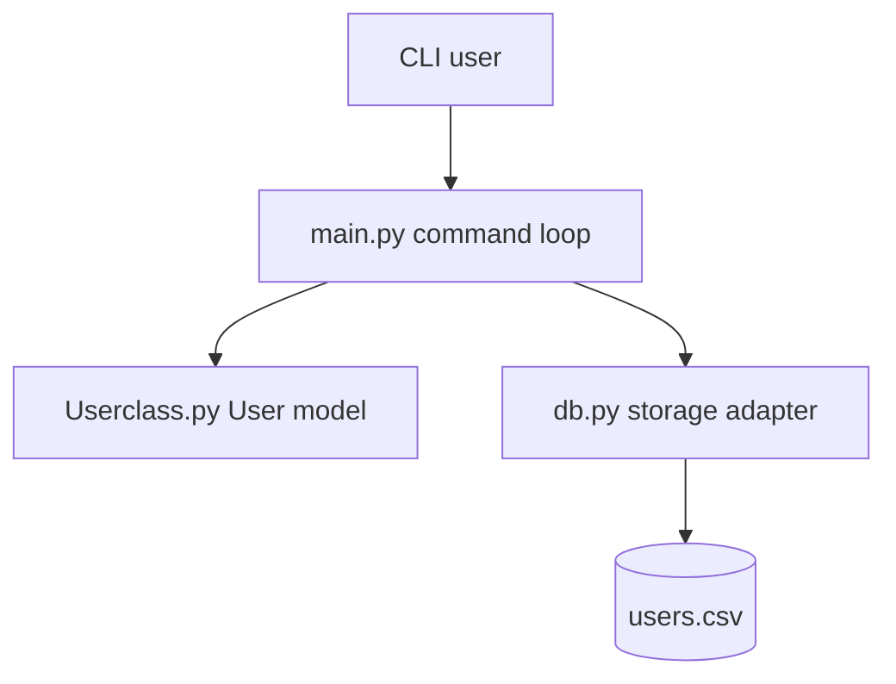
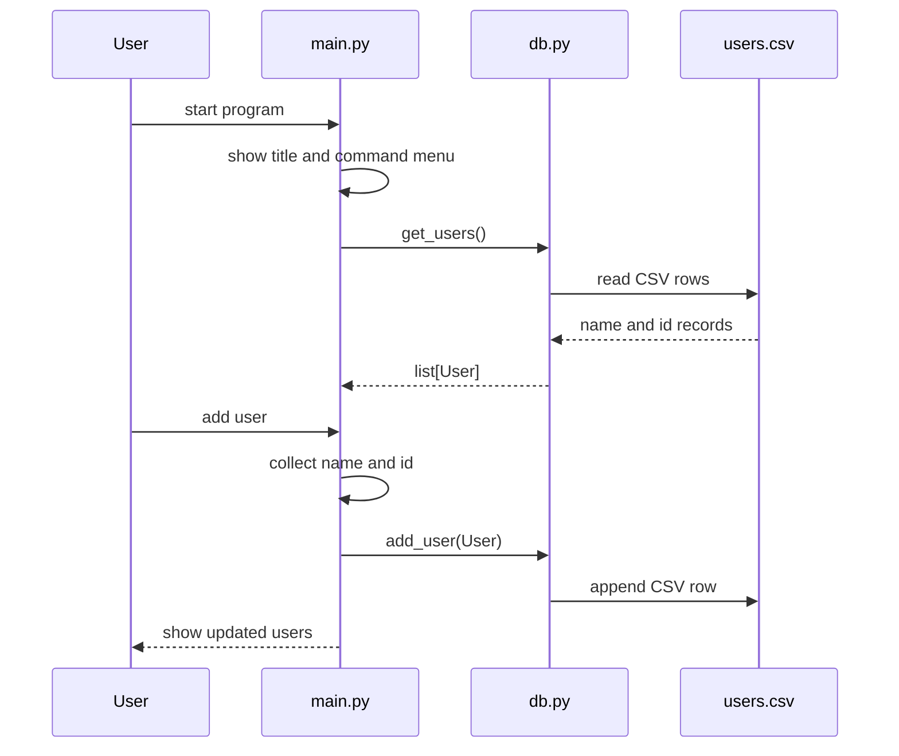

# pythonProject Architecture

## Purpose

`pythonProject` is a compact command-line application for practicing Python
application structure, object modeling, and simple persistence. The project is
small on purpose: it keeps the user workflow visible while separating command
handling, persistence, and domain behavior into different files.

The current system manages a list of users backed by `users.csv`. The same shape
can grow into task-list management, database-backed persistence, or an API layer
without rewriting the whole command loop.

## Repository Map

```text
.
├── main.py          Command menu, user input loop, workflow routing
├── db.py            CSV storage adapter for reading and appending users
├── Userclass.py     User domain model and equality behavior
├── users.csv        Local data file used by the storage adapter
├── scripts/         Shell automation area
└── .github/         GitHub Actions workflow area
```

## Layered Design



### Presentation Layer

`main.py` owns all user-facing terminal behavior:

- prints the title and command menu
- reads commands from `input`
- routes supported commands such as `show users`, `add user`, `del user`, and
  `exit`
- formats user records for terminal display

This layer should remain focused on interaction. It should not know how files
are opened, how a database is queried, or how duplicate users are compared.

### Domain Layer

`Userclass.py` defines the `User` object. It currently stores:

- `_user_name`
- `_user_id`

The class also implements equality using a case-insensitive user-name
comparison. That comparison is the beginning of a domain rule: two users with
the same logical name should be treated as duplicates even when capitalization
differs.

The domain layer is the right place for future behavior such as:

- validating user IDs
- normalizing names
- adding task ownership
- representing task status or priority
- comparing users by a stronger identity model

### Persistence Layer

`db.py` owns the CSV boundary. It defines:

- `FILENAME = "users.csv"`
- `get_users()`
- `add_user(user)`

This isolates file I/O from the CLI workflow. If the project later migrates to
SQLite, MySQL, PostgreSQL, or a REST API, a replacement adapter can keep the
public operations similar while changing the implementation behind them.

## Runtime Flow



## Data Contract

The storage format is a simple two-column CSV row:

```text
user_name,user_id
```

The checked-in `users.csv` acts as local seed data. The current parser expects
the first column to be a string and the second column to be convertible to an
integer.

## Error Boundaries

Current error handling is intentionally lightweight. The important architecture
boundary is that file errors are caught in `db.py` and command errors are handled
in `main.py`.

Recommended future hardening:

- replace broad `except` blocks with specific exceptions
- report malformed CSV rows separately from missing files
- prevent invalid integer input from crashing the command loop
- return clear storage errors to the caller instead of only printing them
- write tests for duplicate detection and CSV round trips

## Extension Plan

The project can grow in these steps:

1. Add unit tests for `User`, `db.get_users`, and `db.add_user`.
2. Replace module-level mutable storage with local return values.
3. Add a `Task` model and a `tasks.csv` adapter.
4. Introduce a repository interface such as `UserRepository`.
5. Add a MySQL or SQLite implementation behind the same repository operations.
6. Add a small Flask/FastAPI service if the CLI should become a web-backed app.
7. Add a React or Node.js front end only after the domain and persistence
   contracts are stable.

## Validation Strategy

Minimum validation for this project should include:

- run the CLI and exercise `show users`
- add a new user and confirm `users.csv` receives a new row
- attempt to add the same user with different capitalization
- run unit tests once they are added
- verify the program can start when `users.csv` is missing or empty

## Architecture Decision Record

| Decision | Current Choice | Reason |
| --- | --- | --- |
| Interface | Command line | Keeps the workflow simple and visible |
| Storage | CSV file | No database dependency required for a starter project |
| Domain object | `User` class | Gives the application a place for identity rules |
| Duplicate rule | Case-insensitive name equality | Prevents obvious duplicate user names |
| Deployment | Local Python execution | Suitable for a learning and automation prototype |

